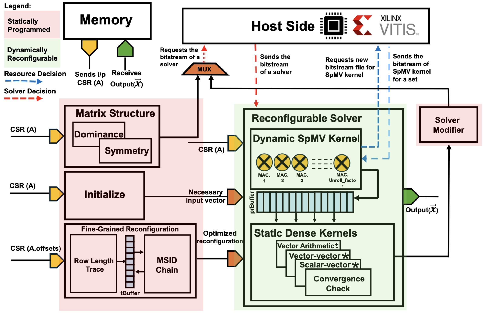

# Acamar: A Dynamically Reconfigurable Scientific Computing Accelerator (MICRO-2024)

Acamar is a dynamically reconfigurable scientific computing accelerator designed for robust convergence and minimal resource utilization. This repository contains the source code for the simulator used to test Acamar. The simulator is written in C++ and driven using Python 3.
## Architecture
    
## Repoistory Structure
The repository has some scrap verilog and python notebook files used in the testing and dataset exporting process. (`Scrap Verilog` & `Scrap Notebooks`) You may or may not find it useful. 
The simulator source code is provided in `C_Sim` directory and is most relevant.

You can read more about Acamar on this [link](https://ieeexplore.ieee.org/document/10764642).

If you find Acamar useful, please cite:
```plaintext
@INPROCEEDINGS {bakhtiar2024acamar,
  author = { Bakhtiar, Ubaid and Hosseini, Helya and Asgari, Bahar },
  booktitle = { 2024 57th IEEE/ACM International Symposium on Microarchitecture (MICRO) },
  title = {{ Acamar: A Dynamically Reconfigurable Scientific Computing Accelerator for Robust Convergence and Minimal Resource Underutilization }},
  year = {2024},
  pages = {1601-1616},
  doi = {10.1109/MICRO61859.2024.00117},
  url = {https://doi.ieeecomputersociety.org/10.1109/MICRO61859.2024.00117},
  publisher = {IEEE Computer Society},
  month = Nov
}
```
